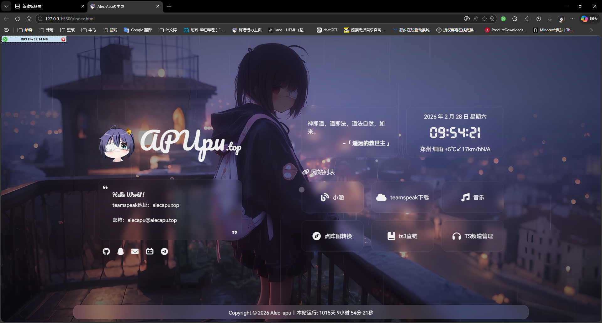
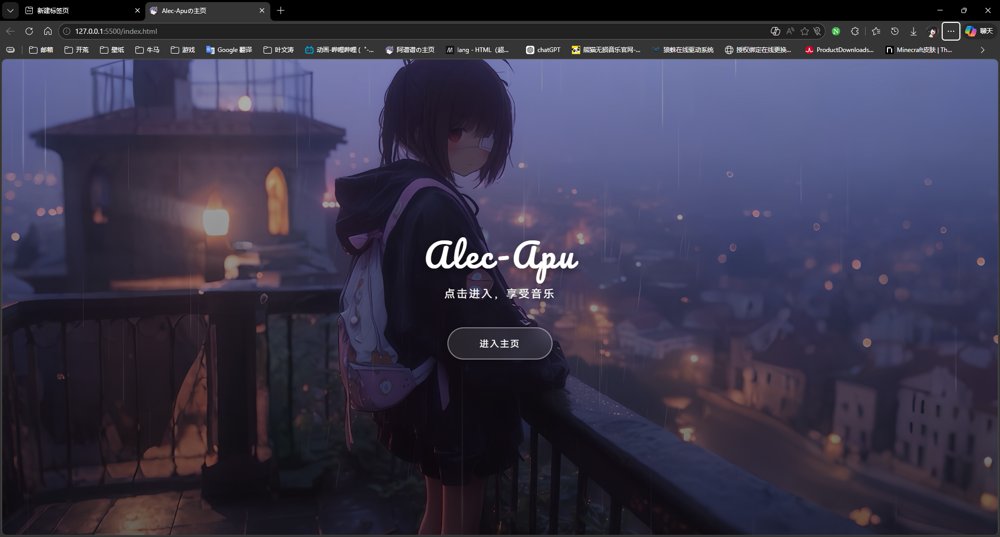

<div align="center">

# 🌟 Alec-Apu 个人主页

[](https://opensource.org/licenses/MIT)
[](https://developer.mozilla.org/zh-CN/docs/Web/HTML)
[](https://developer.mozilla.org/zh-CN/docs/Web/CSS)
[](https://developer.mozilla.org/zh-CN/docs/Web/JavaScript)

一个功能丰富、设计精美的个人主页项目

集成音乐播放器、动态背景、运行时统计、PWA 支持等多项实用功能

完美适配桌面端与移动端，开箱即用

[在线预览](https://apupu.top) • [快速开始](#-快速开始) • [功能文档](#-核心功能)

</div>

---

## 📸 效果展示

<div align="center">





</div>

## ✨ 核心功能

### 🎨 视觉体验
- **动态背景** - 多张高清背景图随机切换，支持自定义
- **欢迎动画** - 首次访问特效，提升用户体验
- **自定义指针** - 炫彩鼠标跟随效果
- **响应式设计** - 完美适配桌面、平板、手机等各种设备
- **深色主题** - 现代化的视觉风格

### 🎵 功能模块
- **音乐播放器** - 集成 APlayer，支持 QQ 音乐、网易云、酷狗等平台
- **运行时统计** - 自动计算网站运行天数和精确时间
- **一言集成** - 每日随机展示一句话，增添趣味
- **通知系统** - iziToast 提示组件，优雅的消息提醒

### 🔧 扩展工具
- **点阵图转换器** (`/Bitmap/`) - 将图片转换为盲文点阵字符艺术
  - 支持抖动算法
  - 黑白反色
  - 深色模式
- **TeamSpeak 监控** - 实时显示游戏服务器频道和在线状态
  - `ts-channel/` - 频道显示模块
  - `teamspeakk/` - 服务器信息显示

### 🚀 技术特性
- **PWA 支持** - 可安装到桌面，支持离线访问
- **Service Worker** - 智能缓存策略，加速访问
- **访问统计** - 集成 51.LA 统计分析
- **浏览器兼容性检测** - 自动识别 IE 并引导升级

## 📁 项目结构

```
📦 Alec-Apu 个人主页
├── 📄 index.html                    # 主页入口
├── 📄 manifest.json                 # PWA 清单文件
├── 📄 sw.js                         # Service Worker
├── 📄 vercel.json                   # Vercel 部署配置
├── 📂 css/                          # 样式文件目录
│   ├── style.css                   # 主样式表
│   ├── mobile.css                  # 移动端适配
│   ├── animation.css               # 动画效果
│   ├── welcome.css                 # 欢迎页样式
│   ├── loading.css                 # 加载动画
│   ├── glass.css                   # 玻璃态效果
│   └── lantern.css                 # 灯笼样式
├── 📂 js/                           # 脚本文件目录
│   ├── main.js                     # 核心逻辑
│   ├── music.js                    # 音乐播放器配置
│   ├── time.js                     # 运行时统计
│   ├── welcome.js                  # 欢迎动画
│   ├── set.js                      # 设置功能
│   ├── lantern.js                  # 灯笼效果
│   ├── runtime.js                  # 运行时工具
│   ├── js.cookie.js                # Cookie 管理
│   └── 51LA.js                     # 统计脚本
├── 📂 img/                          # 图片资源
│   ├── background1-7.png           # 背景图片集
│   └── icon/                       # 图标文件
│       ├── logo.png
│       ├── music.png
│       ├── play.png
│       └── ...
├── 📂 font/                         # 字体文件
├── 📂 Bitmap/                       # 点阵图转换工具
│   ├── index.html                  # 工具页面
│   ├── main.js                     # 主逻辑
│   ├── braille.js                  # 盲文处理
│   ├── dithering.js                # 抖动算法
│   └── style.css                   # 工具样式
├── 📂 ts-channel/                   # TeamSpeak 频道显示
│   ├── index.html
│   ├── css/channel.css
│   ├── js/channel.js
│   └── server/
│       ├── ts-server.js            # 服务器端
│       └── package.json
└── 📂 upgrade-your-browser/         # IE 不兼容提示页
    ├── index.html
    ├── css/support.style.min.css
    └── js/er3eport.min.js
```

## 🚀 快速开始

### 方式一：直接使用

1. **克隆项目**
   ```bash
   git clone https://github.com/Alec-Apu/apuhomepage.git
   cd apuhomepage
   ```

2. **本地预览**
   - **方法 A：** 直接在浏览器中打开 `index.html`
   - **方法 B：** 使用本地服务器（推荐）
     ```bash
     # Windows PowerShell
     .\serve.ps1
     
     # Windows CMD
     .\serve.bat
     
     # Python
     python -m http.server 8080
     
     # Node.js
     npx http-server
     ```

3. **访问应用**
   
   在浏览器打开 `http://localhost:8080` 或直接打开 `index.html`

### 方式二：部署到 Vercel（推荐）

1. Fork 本项目到你的 GitHub
2. 在 [Vercel](https://vercel.com) 登录并导入项目
3. Vercel 自动检测配置并完成部署
4. 获得一个 `https://your-project.vercel.app` 域名

### 方式三：部署到 GitHub Pages

1. 进入项目的 GitHub 仓库设置
2. 找到 `Pages` 选项
3. 选择 `main` 分支作为源
4. 保存后即可通过 `https://username.github.io/apuhomepage` 访问

## 🛠️ 自定义配置

### 🎵 配置音乐播放器

编辑 [`js/music.js`](js/music.js) 文件：

```javascript
let server = "tencent";          // 音乐平台
let type = "playlist";            // 播放列表类型
let id = "你的歌单ID";            // 歌单/专辑/歌曲 ID
```

**支持的音乐平台：**
| 平台 | 参数值 | 说明 |
|------|--------|------|
| QQ 音乐 | `tencent` | 获取歌单 ID：打开 QQ 音乐网页版，复制地址栏中的数字 |
| 网易云音乐 | `netease` | 获取歌单 ID：打开网易云网页版，复制地址栏中 `id=` 后的数字 |
| 酷狗音乐 | `kugou` | 获取歌单 ID：参考平台规则 |

**类型说明：**
- `playlist` - 歌单
- `album` - 专辑
- `song` - 单曲

### 🎨 添加/更换背景图

1. 将图片放入 `img/` 目录
2. 编辑 [`js/main.js`](js/main.js)，修改 `backgroundImages` 数组：

```javascript
const backgroundImages = [
  "./img/background1.png",
  "./img/background2.png",
  "./img/background3.png",
  "./img/background4.png",
  "./img/background5.png",
  "./img/background6.png",
  "./img/background7.png",
  "./img/your-custom-bg.jpg"    // 添加你的背景图
];
```

**建议：**
- 图片分辨率：1920x1080 或更高
- 图片格式：PNG / JPG / WEBP
- 图片大小：建议 < 2MB（优化加载速度）

### 📝 修改个人信息

编辑 [`index.html`](index.html)：

```html
<!-- 页面标题 -->
<title>你的名字の主页</title>

<!-- SEO 配置 -->
<meta name="description" content="你的个人主页描述">
<meta name="keywords" content="你的关键词,个人主页">
<meta name="author" content="你的名字">

<!-- 主页内容区域 -->
<div class="container">
    <h1>你的名字</h1>
    <p>你的个性签名</p>
</div>
```

同时修改 [`manifest.json`](manifest.json)：

```json
{
  "name": "你的主页名称",
  "short_name": "简称",
  "description": "主页描述"
}
```

### ⏰ 设置运行时统计起始日期

编辑 [`js/time.js`](js/time.js)：

```javascript
const startDate = new Date("2024/01/01 00:00:00");  // 修改为你的网站上线日期
```

### 📊 配置网站统计

如需使用 51.LA 统计：

1. 注册 [51.LA](https://www.51.la/) 账号
2. 创建统计站点，获取统计 ID
3. 编辑 [`js/51LA.js`](js/51LA.js) 或 [`index.html`](index.html)，替换统计代码

### 🎮 配置 TeamSpeak 模块（可选）

如果你需要显示 TeamSpeak 服务器信息：

1. **频道显示** - 编辑 [`ts-channel/js/channel.js`](ts-channel/js/channel.js)
2. **服务器信息** - 编辑 [`teamspeakk/js/ts-channel.js`](teamspeakk/js/ts-channel.js)
3. **后端服务** - 配置 Node.js 服务器（见各目录的 README）

## 📦 技术栈

### 前端核心
| 技术 | 版本 | 用途 |
|------|------|------|
| HTML5 | - | 页面结构 |
| CSS3 | - | 样式设计 |
| JavaScript | ES6+ | 交互逻辑 |
| jQuery | 3.5.1 | DOM 操作 |
| Bootstrap | 5.1.0 | 响应式布局 |

### UI 组件
| 组件 | 版本 | 用途 |
|------|------|------|
| [APlayer](https://aplayer.js.org/) | 1.10.1 | 音乐播放器 |
| [iziToast](https://izitoast.marcelodolza.com/) | 1.4.0 | 消息通知 |
| [Font Awesome](https://fontawesome.com/) | 6.1.2 | 图标库 |
| HarmonyOS Sans | - | 主字体（B站 CDN） |

### 功能特性
- **PWA（Progressive Web App）**
  - Manifest 配置
  - Service Worker 缓存策略
  - 可安装到桌面
- **一言 API**（[Hitokoto](https://hitokoto.cn/)）
- **51.LA 统计**
- **响应式设计**（媒体查询）

### 第三方服务
```javascript
// CDN 来源
- BootCDN：jQuery, Bootstrap, APlayer, iziToast, Font Awesome
- B 站 CDN：HarmonyOS Sans 字体
- 一言 API：随机句子
- 51.LA：访问统计
```

## 🧰 扩展工具

### 🖼️ 点阵图转换器 (`/Bitmap/`)

将任意图片转换为盲文点阵字符艺术，采用与主页一致的玻璃态设计风格。

**访问地址：** `https://your-domain.com/Bitmap/`

**功能特性：**
- ✅ 上传图片转换为字符艺术
- ✅ 支持抖动算法（Dithering）
- ✅ 黑白反色
- ✅ 深色/浅色模式切换
- ✅ 一键复制结果
- ✨ 玻璃态毛玻璃效果
- ✨ 与主页统一的设计风格
- ✨ 响应式布局
- ✨ 自定义鼠标指针

**UI 特色：**
- 🎨 采用主页同款玻璃态设计（Glassmorphism）
- 🎯 HarmonyOS Sans 字体
- 🖱️ 自定义鼠标指针效果
- 🌈 渐变色按钮和开关
- 📱 完美适配移动端

**使用方法：**
1. 打开 `/Bitmap/index.html`
2. 点击 "选择图片" 按钮上传文件
3. 调整宽度、灰度模式等参数
4. 等待转换完成
5. 点击 "复制到剪贴板" 保存结果

**参数说明：**
- **宽度**：控制输出字符的宽度（2-500）
- **灰度模式**：亮度/明度/平均值/色值
- **深色模式**：改变输出文本颜色
- **反色**：黑白反转
- **像素抖动**：使用 Floyd-Steinberg 算法
- **等宽字体**：优化字符间距

**示例效果：**
```
⠀⠀⠀⠀⣀⣀⣀⣀⣀⣀⣀⣀⣀⣀⣀⣀⣀⠀⠀⠀⠀
⠀⠀⠀⣾⣿⣿⣿⣿⣿⣿⣿⣿⣿⣿⣿⣿⣿⣷⠀⠀⠀
⠀⠀⠀⣿⣿⣿⣿⣿⣿⣿⣿⣿⣿⣿⣿⣿⣿⣿⠀⠀⠀
```

**技术实现：**
- Canvas API 处理图片
- 盲文 Unicode 字符映射（U+2800 - U+28FF）
- Floyd-Steinberg 抖动算法
- Backdrop Filter 毛玻璃效果
- CSS3 渐变和动画

### 🎮 TeamSpeak 监控

实时显示游戏服务器频道和在线状态。

**两个版本：**
1. **ts-channel** - 简洁版频道树状显示
2. **teamspeakk** - 完整版服务器信息面板

**需要：**
- Node.js 后端服务
- TeamSpeak Server Query API 权限
- 见各目录下的 README 配置说明

## � 浏览器兼容性

| 浏览器 | 支持情况 | 备注 |
|--------|----------|------|
| Chrome | ✅ 推荐 | 完整支持所有特性 |
| Edge | ✅ 推荐 | 完整支持所有特性 |
| Firefox | ✅ 支持 | 完整支持 |
| Safari | ✅ 支持 | 完整支持 |
| Opera | ✅ 支持 | 基于 Chromium |
| IE 11 及以下 | ❌ 不支持 | 自动跳转至升级引导页 |

**推荐使用最新版本的现代化浏览器以获得最佳体验**

## ❓ 常见问题

<details>
<summary><b>音乐播放器无法加载歌曲？</b></summary>

**可能原因：**
1. 歌单 ID 错误或歌单被设为私密
2. 音乐 API 服务不可用
3. 跨域问题（本地开发）

**解决方案：**
- 检查歌单 ID 是否正确
- 确保歌单为公开状态
- 使用本地服务器运行（不要直接双击打开 HTML）
- 更换音乐平台或歌单
</details>

<details>
<summary><b>背景图片不显示？</b></summary>

**检查事项：**
1. 图片路径是否正确
2. 图片文件是否存在
3. 浏览器控制台是否有 404 错误
4. 图片格式是否支持（推荐 PNG/JPG/WEBP）

**调试方法：**
按 F12 打开开发者工具，查看 Network 和 Console 标签
</details>

<details>
<summary><b>如何禁用欢迎动画？</b></summary>

编辑 `js/welcome.js`，修改或注释相关代码：

```javascript
// 禁用欢迎动画
// welcomeAnimation();
```

或在 `index.html` 中移除 `welcome.css` 和 `welcome.js` 的引用。
</details>

<details>
<summary><b>PWA 安装按钮没有显示？</b></summary>

**要求：**
- 使用 HTTPS 协议（本地 localhost 除外）
- Service Worker 正确注册
- Manifest.json 配置完整

**检查：**
1. 打开开发者工具 -> Application -> Manifest
2. 查看是否有错误提示
3. 确保所有图标文件存在
</details>

<details>
<summary><b>如何更换网站图标（Favicon）？</b></summary>

替换以下文件：
- `favicon.ico` - 浏览器标签图标
- `img/icon/logo.png` - 通用 Logo
- `img/icon/apple-touch-icon.png` - iOS 添加到主屏幕图标
- `img/icon/48.png ~ 512.png` - PWA 应用图标（多尺寸）
</details>

<details>
<summary><b>TeamSpeak 模块报错？</b></summary>

TeamSpeak 模块需要后端服务支持：
1. 进入对应目录：`ts-channel/server/` 或 `teamspeakk/server/`
2. 安装依赖：`npm install`
3. 配置 TS Server Query 信息
4. 启动服务：`node ts-server.js` 或 `node server.js`

如不需要此功能，可以从主页移除相关引用。
</details>

## 🔧 开发指南

### 本地开发环境搭建

```bash
# 1. 克隆项目
git clone https://github.com/Alec-Apu/apuhomepage.git
cd apuhomepage

# 2. （可选）安装 Node.js 依赖（如需 TS 模块）
cd ts-channel/server
npm install
cd ../..

# 3. 启动开发服务器
# 方式 A：使用 Python
python -m http.server 8080

# 方式 B：使用 Node.js
npx http-server -p 8080

# 方式 C：使用 VS Code Live Server 插件
# 打开 index.html，右键选择 "Open with Live Server"
```

### 目录说明

- **`/css/`** - 所有样式表，模块化管理
- **`/js/`** - JavaScript 脚本，功能分离
- **`/img/`** - 图片资源（背景、图标等）
- **`/font/`** - 自定义字体文件
- **`/Bitmap/`** - 独立工具：图片转字符艺术
- **`/ts-channel/`** - TeamSpeak 频道显示（含后端）
- **`/teamspeakk/`** - TeamSpeak 服务器信息（含后端）
- **`/upgrade-your-browser/`** - IE 浏览器升级引导页
- **`manifest.json`** - PWA 应用配置
- **`sw.js`** - Service Worker 缓存策略
- **`vercel.json`** - Vercel 部署配置

### 代码风格

- 使用 2 空格缩进
- 变量命名采用驼峰命名法
- 函数名使用动词开头
- 注释使用中文
- CSS 类名使用连字符分隔

### 性能优化建议

1. **图片优化**
   - 压缩背景图至 200-500KB
   - 使用 WebP 格式（提供 PNG/JPG 降级）
   - 使用响应式图片

2. **代码优化**
   - 合并和压缩 CSS/JS 文件
   - 使用 CDN 加速第三方库
   - 启用浏览器缓存

3. **加载优化**
   - 关键 CSS 内联
   - 非关键 JS 异步加载
   - 图片懒加载

## 📝 更新日志

### v2.1.0 (2026-03-11)
- ✨ 新增 TeamSpeak 新手教程页（`/ts-guide/`），补充从下载到连接的完整步骤
- 🌐 新增 TS3 简体中文语言包下载入口与安装说明
- 📚 新增“谱谱大家庭”创建永久频道教程与频道管理规则提示
- 🎨 优化教程页文案，降低新手理解门槛
- 🔗 主页 `ts教程` 卡片图标替换为 TeamSpeak 品牌图标

### v2.0.0 (2026-02-28)
- ✨ 新增 Bitmap 点阵图转换工具
- ✨ 新增灯笼装饰效果
- 🎨 优化 UI 设计和动画效果
- 🐛 修复移动端适配问题
- 📚 完善项目文档

### v1.0.0 (2024-XX-XX)
- 🎉 初始版本发布
- ✨ 基础功能实现
  - 动态背景
  - 音乐播放器
  - 运行时统计
  - 欢迎动画
  - PWA 支持
- 🎮 集成 TeamSpeak 模块

## 📄 许可证

本项目基于 [MIT License](LICENSE) 开源。

```
MIT License

Copyright (c) 2024 ,Alec-Apu,imsyy

Permission is hereby granted, free of charge, to any person obtaining a copy
of this software and associated documentation files (the "Software"), to deal
in the Software without restriction...
```

**这意味着你可以：**
- ✅ 自由使用本项目代码
- ✅ 修改和二次开发
- ✅ 商业使用
- ✅ 分发和再许可

**唯一要求：**
- 📋 保留原作者版权声明

## 👨‍💻 作者

**Alec-Apu**

- 🌐 个人主页：[https://apupu.top](https://apupu.top)
- 📧 联系方式：见主页
- 💻 GitHub：[@Alec-Apu](https://github.com/Alec-Apu)

## 🌟 致谢

感谢以下开源项目和服务：

- [APlayer](https://github.com/MoePlayer/APlayer) - 音乐播放器
- [iziToast](https://github.com/marcelodolza/iziToast) - 通知组件
- [Font Awesome](https://fontawesome.com/) - 图标库
- [Hitokoto](https://hitokoto.cn/) - 一言 API
- [BootCDN](https://www.bootcdn.cn/) - 前端 CDN
- [Vercel](https://vercel.com/) - 部署平台

## 🤝 贡献

欢迎提交 Issue 和 Pull Request！

**贡献指南：**
1. Fork 本仓库
2. 创建特性分支：`git checkout -b feature/AmazingFeature`
3. 提交更改：`git commit -m 'Add some AmazingFeature'`
4. 推送到分支：`git push origin feature/AmazingFeature`
5. 提交 Pull Request

**贡献类型：**
- 🐛 Bug 修复
- ✨ 新功能开发
- 📚 文档改进
- 🎨 UI/UX 优化
- ♻️ 代码重构
- ⚡ 性能优化

## 💬 反馈与支持

- **问题反馈：** [GitHub Issues](https://github.com/Alec-Apu/apuhomepage/issues)
- **功能建议：** [GitHub Discussions](https://github.com/Alec-Apu/apuhomepage/discussions)
- **使用交流：** 见主页联系方式

---

<div align="center">

**如果这个项目对你有帮助，请给个 ⭐ Star 支持一下！**

Made with ❤️ by [Alec-Apu](https://github.com/Alec-Apu)

[返回顶部](#-alec-apu-个人主页)

</div>
